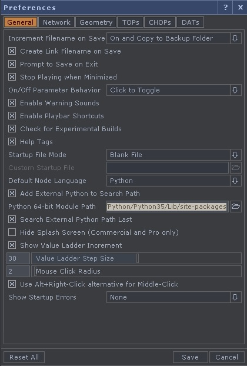
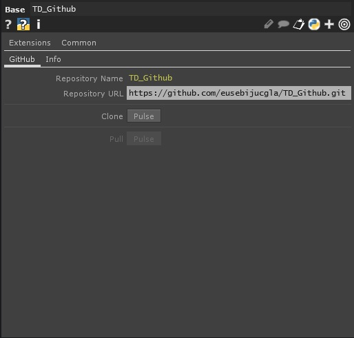

# TD_Github

This is a component for Touch Designer to clone and pull a Github repository in your working directory.

### Dependencies and setting up

This component uses [PyGithub](https://github.com/PyGithub/PyGithub) to clone and pull repositories. In order for the component to function you will need to install it:
`pip install PyGithub`

After PyGithub is installed, you have to set the Pyhon Module path in TouchDesigner.

  

The path should reference the 'sites-package' folder, from the location you installed python in your computer. As an example:

`C:/Users/**your user**/AppData/Local/Programs/Python/Python35/Lib/site-packages`

### How it works

Just copy the link of the repository as HTTPS and paste it in the component `Repository URL` and clone.

  

